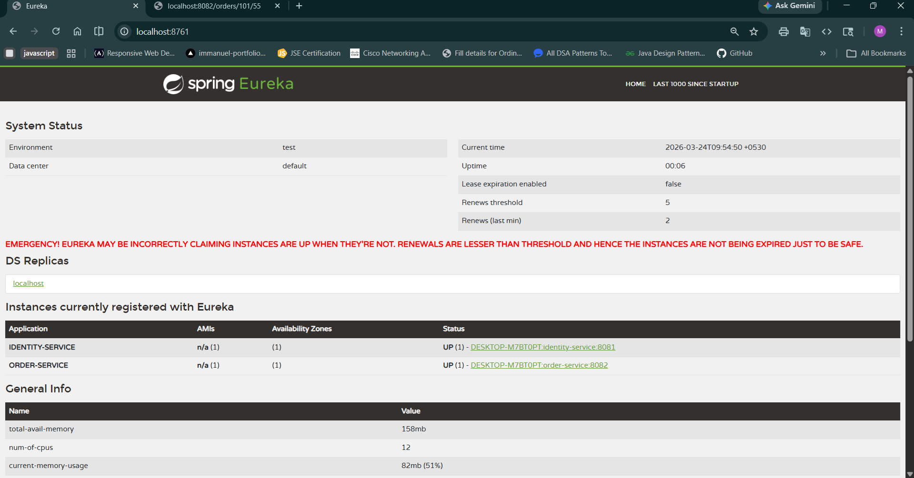

# 🚀 Microservices-Based System – Task 14

## 📌 Overview
This project demonstrates the transformation of a **monolithic application** into a **microservices-based architecture** using **Spring Boot** and **Eureka Service Discovery**.

The system is divided into independent services that communicate over REST APIs, ensuring:
- 🔹 Loose Coupling  
- 🔹 High Scalability  
- 🔹 Independent Deployment  
- 🔹 Better Maintainability  

---

## 🏗️ Architecture Diagram

```
                ┌────────────────────┐
                │   Eureka Server    │
                │ (Service Registry) │
                └─────────┬──────────┘
                          │
        ┌─────────────────┼─────────────────┐
        │                                   │
┌───────────────┐                 ┌──────────────────┐
│ Identity      │                 │ Order Service     │
│ Service       │◄────REST───────►│ (Uses Identity)   │
│ (User Data)   │                 │                  │
└───────────────┘                 └──────────────────┘
```

---

## 📂 Project Structure

```
Task_14/
│
├── eureka-server/        
├── identity-service/     
├── order-service/        
├── output1.png           
├── output2.png           
└── README.md
```

---

## ⚙️ Technologies Used

- ☕ Java (JDK 17+)
- 🌱 Spring Boot
- 🌐 Spring Cloud Netflix Eureka
- 📦 Maven
- 🧰 Eclipse IDE

---

## 🔧 Microservices Description

### 🔹 1. Eureka Server
- Acts as a **service registry**
- All services register here
- Enables service discovery

📍 Runs on: http://localhost:8761

---

### 🔹 2. Identity Service
- Handles **user-related operations**
- Provides REST APIs for user data
- Registers with Eureka

📍 Example Endpoint:
GET /users

---

### 🔹 3. Order Service
- Handles **order processing**
- Communicates with Identity Service using REST
- Demonstrates **inter-service communication**

📍 Example Endpoint:
GET /orders

---

## ▶️ How to Run the Project (Step-by-Step)

### 1️⃣ Start Eureka Server
Run: EurekaServerApplication.java

### 2️⃣ Start Identity Service
Run: IdentityServiceApplication.java

### 3️⃣ Start Order Service
Run: OrderServiceApplication.java

### 4️⃣ Verify Services
Go to: http://localhost:8761

✔️ You should see:
- identity-service  
- order-service  

---

## 🔗 Service Communication

- order-service calls identity-service
- Uses REST APIs
- Demonstrates **loose coupling**

---

## 📸 Output Screenshots

### 🖼️ Eureka Dashboard


### 🖼️ API Response


---

## 💡 Microservices Principles Applied

✔️ Single Responsibility  
✔️ Loose Coupling  
✔️ Independent Deployment  
✔️ Service Discovery  

---

## 🚀 Key Features

- ✅ Distributed architecture  
- ✅ Scalable system design  
- ✅ Real-time service discovery  
- ✅ Inter-service communication  

---

## 📚 Conclusion

This project demonstrates how a monolithic system can be converted into microservices for better scalability and maintainability.

---

## 👩‍💻 Author

Maria Immanuel L
